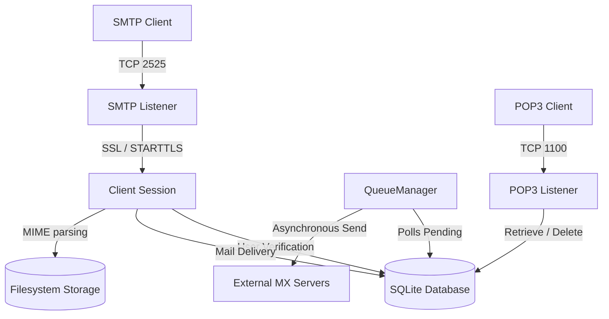

# MailForge

MailForge is a high-performance, asynchronous SMTP and POP3 mail server implemented in modern C++20. It features built-in SQLite persistence, user authentication, a background mail delivery queue, transport security (TLS/STARTTLS), and multi-part MIME parsing.

---

## Key Features & Architecture



* **Dual Protocol Listeners**: Runs SMTP (port `2525`) and POP3 (port `1100`) simultaneously on an asynchronous thread-pool.
* **STARTTLS Transport Security**: Dynamically upgrades plain text connections to encrypted SSL/TLS channels using OpenSSL and Boost.Asio.
* **Authentication**: Supports `AUTH PLAIN` and `AUTH LOGIN` mechanisms with SHA-256 salted password hashing.
* **Database & FS Storage**: Stores emails in both an organized `.eml` filesystem layout and a structured SQLite database.
* **Background Mail Queue**: Automatically enqueues external emails, resolves DNS MX records, and retries delivery asynchronously on failure.
* **MIME Parsing**: Parses multipart messages, extracts HTML/Text bodies, and decodes Base64 attachments.

---

## Build Instructions

### Prerequisites
Install the required packages (Linux/Ubuntu):
```bash
sudo apt-get update
sudo apt-get install -y cmake ninja-build g++ libboost-all-dev libsqlite3-dev libssl-dev
```

### Build Steps
```bash
# Configure and build
cmake -S . -B build -DCMAKE_EXPORT_COMPILE_COMMANDS=ON
cmake --build build

# Run unit & smoke tests
ctest --test-dir build --output-on-failure
```

---

## Running the Server

Start the server using the configuration file:
```bash
./build/mailforge config/mailforge.json
```

---

## Developer Testing Guide

### 1. Generating Secure Certificates (STARTTLS)
If you need to regenerate the self-signed certificates used by STARTTLS:
```bash
openssl req -x559 -nodes -days 365 -newkey rsa:2048 -keyout config/server.key -out config/server.crt -subj "/CN=localhost"
```

### 2. Testing SMTP with STARTTLS & Auth
Connect using the OpenSSL secure client:
```bash
openssl s_client -connect localhost:2525 -starttls smtp -ign_eof
```

Once connected, complete the exchange:
```smtp
EHLO client.local
AUTH PLAIN AGFkbWluAGFkbWlucGFzcw==
MAIL FROM:<sender@example.com>
rcpt to:<admin>
DATA
Subject: Hello MailForge

This is an email sent securely!
.
QUIT
```
*(Note: Use lowercase `rcpt to:` to prevent OpenSSL from intercepting commands starting with `R` as renegotiation requests)*

### 3. Testing POP3 Message Retrieval
Connect via POP3 on port 1100:
```bash
nc localhost 1100
```

Log in and retrieve messages:
```pop3
USER admin
PASS adminpass
STAT
RETR 1
QUIT
```

### 4. Inspecting Database Status
Query messages directly from the database:
```bash
sqlite3 mailforge.db "SELECT id, recipient, status, attempts FROM messages;"
```
* **Local Delivery**: Status transitions instantly to `delivered`.
* **External Delivery**: Status is marked as `pending` while the background `QueueManager` resolves DNS and executes SMTP delivery. Retries are scheduled automatically.

---

## Running with Docker

You can containerize MailForge using the provided multi-stage `Dockerfile` and `docker-compose.yml`.

### Build & Run
```bash
# Build and start container services in the background
docker compose up -d --build
```

This will compile the C++ application in an optimized builder image, copy it to a minimal runner image, expose ports `2525` and `1100`, and mount configurations read-only.

---

## Web Dashboard & Email Composer

MailForge includes a lightweight web dashboard that lets you manage mailboxes, inspect the queue, and send test emails via a graphical composer.

### Running Locally
1. Start the C++ mail server:
   ```bash
   ./build/mailforge config/mailforge.json
   ```
2. Open another terminal, install dependencies, and run Flask:
   ```bash
   sudo apt install python3-flask
   python3 dashboard/app.py
   ```
3. Open **`http://localhost:5000`** in your browser.

### Running with Docker Compose
Run both the C++ mail server and the web dashboard concurrently:
```bash
docker compose up -d --build
```
The dashboard service automatically maps to port `5000`. You can visit **`http://localhost:5000`** directly.