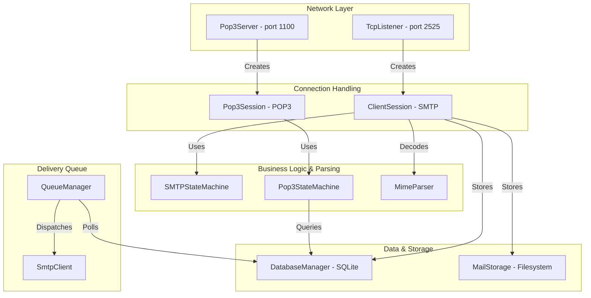
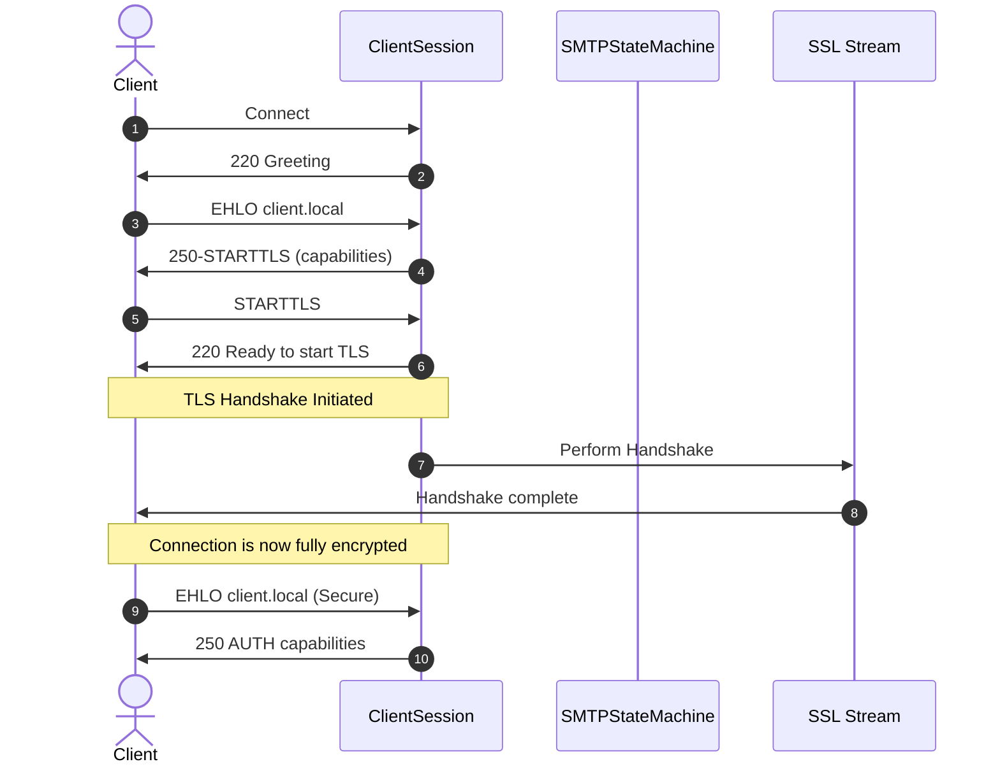
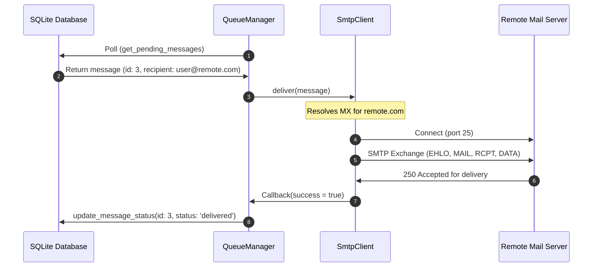

# MailForge Architecture & Developer Guide

This document describes the high-level architecture, module details, API specifications, and transaction sequence diagrams for MailForge.

---

## 1. System Architecture

MailForge is structured as a modular, asynchronous mail server utilizing a multi-threaded event-loop architecture.



### Threading Model
* **Event Loop Pool**: Boost.Asio's `io_context` runs on a thread pool (size configurable via `thread_pool`, defaulting to 4). All asynchronous reads, writes, TCP accepts, and DNS queries execute on this pool.
* **Background Queue Manager**: `QueueManager` runs a separate background thread pool dedicated to polling the SQLite database and processing scheduled delivery retries.
* **Synchronization**: SQLite accesses are thread-safe and serialized using a mutual exclusion lock (`std::mutex`) inside `DatabaseManager`.

### Database Schema
MailForge persists user credentials, email tracking records, and metadata in an SQLite database:
1. `users` table: Holds user credentials and SHA-256 password hashes.
2. `messages` table: Holds transaction metadata, recipient details, and message status (`delivered`, `pending`, `failed`, or `deleted`), as well as retries (`attempts`).
3. `attachments` table: Stores filename and metadata pointing to file attachments.

---

## 2. Module Specifications

### `network`
* **`TcpListener`**: Sets up TCP socket binding, sets options (SO_REUSEADDR), starts accepting connections, and spawns `ClientSession` instances. Manages the `ssl_context` for STARTTLS upgrades.
* **`ClientSession`**: Manages the connection lifecycle of an SMTP client. Dynamically wraps the raw socket into a `boost::asio::ssl::stream` when the client requests a TLS upgrade.

### `smtp`
* **`SMTPParser`**: Lexes and validates raw SMTP commands.
* **`SMTPStateMachine`**: Maintains state transitions (Greeting $\rightarrow$ Mail Envelope $\rightarrow$ Recipient List $\rightarrow$ Data Intake $\rightarrow$ Finished). Handles plain-text authentication.
* **`SmtpClient`**: Asynchronous SMTP relay client. Resolves recipient MX records (using `host -t mx`) and delivers queued mails over port 25.

### `pop3`
* **`Pop3Server`**: Accepts incoming POP3 client sockets on port `1100`.
* **`Pop3StateMachine`**: Handles POP3 command transitions (`USER` $\rightarrow$ `PASS` $\rightarrow$ `STAT`/`LIST`/`RETR`/`DELE` $\rightarrow$ `QUIT`).

### `queue`
* **`QueueManager`**: Implements the background worker loop. Polls the database for messages with `"pending"` status, initiates retry policies (exponential/linear backoff), and marks records as `"delivered"` or `"failed"`.

### `dashboard`
* **`app.py`**: Lightweight Flask backend connecting to SQLite (`mailforge.db`) and communicating over SMTP (`localhost:2525`).
* **`index.html`**: Glassmorphism single-page application for mailbox views and web email composition.

---

## 3. API Documentation

### `database::DatabaseManager`
Handles all connections, schemas, and queries.
```cpp
class DatabaseManager {
public:
    explicit DatabaseManager(const std::filesystem::path& db_path);

    bool register_user(const std::string& username, const std::string& password);
    bool verify_user(const std::string& username, const std::string& password);

    std::int64_t store_message(const std::string& sender, 
                               const std::string& recipient, 
                               const std::string& subject, 
                               const std::string& body, 
                               const std::string& status);

    std::vector<PendingMessage> get_pending_messages();
    std::vector<PendingMessage> get_user_messages(const std::string& username);
    void update_message_status(std::int64_t id, const std::string& status, int attempts);
    void delete_message(std::int64_t id);
};
```

### `mime::MimeParser`
Parses raw mail content containing attachments and multipart boundaries.
```cpp
class MimeParser {
public:
    explicit MimeParser(const std::string& raw_content);

    const std::string& text_body() const;
    const std::string& html_body() const;
    const std::vector<Attachment>& attachments() const;
};
```

---

## 4. Sequence Diagrams

### SMTP Receive with STARTTLS


### Queue Delivery Path (Outgoing Email)


---

## 5. Future Roadmap

1. **IMAP4 Protocol Support**: Introduce an IMAP server module (Phase 13+) enabling clients to synchronize folder structures (`INBOX`, `Sent`, `Drafts`) dynamically.
2. **Spam & Security Verification (DKIM / SPF / DMARC)**: Integrate validation checks for incoming relays to verify sender identity.
3. **Admin Web Dashboard**: Provide a responsive REST-based management panel to inspect queues, manage users, and view server performance metrics.
